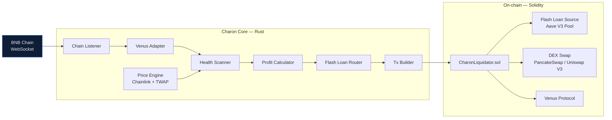

# Charon

> Multi-chain, flash-loan-backed liquidation bot — written in Rust.

[](LICENSE)
[](https://www.rust-lang.org/)
[](https://github.com/obchain/Charon/releases)
[](https://github.com/obchain/Charon/pkgs/container/charon)

Charon monitors under-collateralized positions across major DeFi lending protocols and executes profitable liquidations using flash loans — **zero upfront capital, zero position risk**. If a liquidation turns out to be unprofitable at execution time, the entire transaction reverts atomically; the only cost is a failed simulation's gas.

> Named after the mythological ferryman. Charon carries underwater positions to their final destination.

---

## Table of Contents

- [Status](#status)
- [How it works](#how-it-works)
- [Key features](#key-features)
- [Safety model](#safety-model)
- [Getting started](#getting-started)
- [Configuration](#configuration)
- [Overnight automation (auditor + implementer)](#overnight-automation-auditor--implementer)
- [Metrics](#metrics)
- [Deploy (single host, e.g. Hetzner CX22)](#deploy-single-host-eg-hetzner-cx22)
- [Project structure](#project-structure)
- [Roadmap](#roadmap)
- [Contributing](#contributing)
- [License](#license)

---

## Status

**v0.1 — local end-to-end validated.** Full pipeline runs against a local anvil fork of BSC mainnet: chain listener, Venus adapter (48 vToken markets, Diamond proxy), Chainlink price feeds (BNB / BTCB / ETH / USDT / USDC), Aave V3 flash-loan adapter (0.05 % premium verified), `CharonLiquidator.sol` deployed and exercised via the simulation gate, Prometheus metrics on `:9091`, Grafana dashboard live on `:3000`. The bot scans operator-supplied borrowers every block, classifies them HOT / WARM / COLD by health factor, and runs the full profit / build / simulate / queue / sign chain on liquidatable positions.

**Current scope:** Venus Protocol on BNB Chain. Other protocols and chains are on the [roadmap](#roadmap).

**One outstanding gap to autonomous operation:** a paid BSC archive RPC. Free public tiers (dRPC, BlastAPI, 1rpc.io, Ankr) reject the 200 k-block `eth_getLogs` backfill needed for borrower auto-discovery — either rate-limit, return HTTP 500s, or cap chunks at 5 k blocks. Until then, borrowers are passed manually via `--borrower <addr>` (multiple flags allowed). One env var swap to a keyed archive (QuickNode, BlockPi, paid dRPC, Alchemy, Chainstack) unlocks auto-discovery — no code change.

> ⚠️ **Do not run this against mainnet with real funds yet.** End-to-end is proven on fork only. Production checklist (private mempool relay, audited mainnet `CharonLiquidator` deploy, HSM/KMS signer, alerting) lives in the [Roadmap](#roadmap).

---

## How it works



1. **Listen** — A WebSocket listener receives new blocks and log events from the chain.
2. **Decode** — Protocol adapters normalize raw events into a shared `Position` struct — the rest of the pipeline doesn't care whether the source is Venus, Aave, or anything else.
3. **Price** — A price engine reads live USD prices from Chainlink, with Uniswap V3 TWAPs as a fallback when Chainlink is unavailable or stale.
4. **Scan** — The health scanner recomputes health factors and flags any position that drops below `1.0`.
5. **Estimate** — The profit calculator simulates the full liquidation end-to-end (gas + flash-loan fee + expected DEX slippage) and drops anything below a per-chain USD threshold.
6. **Route** — The flash-loan router picks the cheapest available source (Balancer 0 % → Aave V3 0.05 % → Uniswap V3 pool fee).
7. **Build** — The transaction builder encodes the call, dry-runs it via `eth_call`, signs, and submits (via Flashbots on Ethereum, private RPC on L2s).
8. **Execute** — On-chain, `CharonLiquidator.sol` atomically: flash-borrows → calls the protocol's liquidation entry point → swaps seized collateral back to the debt token → repays the flash loan → forwards profit to the bot's hot wallet. If any step fails, the entire transaction reverts.

---

## Key features

- **Zero capital required.** Every liquidation is flash-loan-backed. No pre-funded position, no locked inventory.
- **Protocol-agnostic.** Adding a new lending protocol means implementing a single Rust trait (`LendingProtocol`). No changes to scanning, routing, or execution.
- **Multi-chain by design.** A single binary monitors multiple EVM chains in parallel. v0.1 ships BSC; v0.3 expands to Ethereum, Arbitrum, Polygon, Base, and Avalanche.
- **Rust performance.** `tokio` async runtime, lock-free concurrent state via `DashMap`, sub-50 ms block-to-broadcast latency target. Designed to run comfortably on a $5 VPS.
- **Flash-loan atomicity.** Bad slippage, race conditions, and math errors all revert the transaction — the protocol never loses its liquidity, and the bot never loses capital.
- **Open source, MIT licensed.** Community extensions welcome.

---

## Safety model

Every liquidation has the atomic form:

```
borrow (flash) → liquidate → swap → repay flash → profit
```

If the chain of operations cannot repay the flash loan in full, the EVM reverts the entire transaction — including the flash borrow itself. Concretely:

| Failure mode | Outcome |
|---|---|
| Profit estimate was wrong | Tx reverts, flash source gets its capital back, bot pays only gas |
| DEX swap slippage exceeds slippage guard | Tx reverts atomically — no capital change |
| Another bot won the race | `eth_call` simulation catches 99 %+ before submit, so no gas spent |
| Oracle update mid-transaction pushes health back ≥ 1.0 | Tx reverts on the liquidation call |

**Worst case:** gas for a single failed transaction (typically $0.01–$5 depending on chain).
**Best case:** profit lands in the bot's hot wallet.
**No intermediate case** where bot capital is lost — this is the fundamental guarantee of flash-loan design.

---

## Getting started

### Prerequisites

- **Rust** — edition 2024 / `rustc 1.85+`. Install via [rustup.rs](https://rustup.rs/).
- **A BNB Chain RPC endpoint** — `.env.example` ships with public-node defaults (good for light testing, rate-limited in production). For real use, point it at a private endpoint (QuickNode, Ankr, Blast, or your own node).

### Clone and build

```bash
# via HTTPS
git clone https://github.com/obchain/Charon.git

# or via SSH
git clone git@github.com:obchain/Charon.git

cd Charon
git submodule update --init --recursive   # contracts/lib (forge-std, OZ, Aave V3)
cargo build --release                     # ~3–5 min cold; ~150 MB final binary
cargo test --workspace                    # unit + integration tests
forge test --root contracts               # Solidity unit tests (no fork)
```

### Configure

```bash
cp .env.example .env
# edit .env with your RPC endpoints
```

### After cloning — what you can do

Three first-class paths once `cargo build` succeeds. Pick whichever matches the goal.

| Goal | Profile | Capital risk | Walkthrough |
|---|---|---|---|
| **Sanity-check the RPC + config** | any | none | `cargo run -- --config config/default.toml test-connection --chain bnb` — prints latest block. |
| **Run the full pipeline against a local fork of BSC mainnet (recommended demo)** | `config/fork.toml` | none | [Local anvil fork](#local-anvil-fork--full-end-to-end-demo-validated-april-2026) — three-pane walkthrough below. |
| **Run scan-only against BSC mainnet (read-only, no signing)** | `config/default.toml` | none — no signer | `cargo run --release -- --config config/default.toml listen --borrower 0x…` |
| **Run with broadcast against BSC mainnet** | `config/default.toml` | real funds at risk | Read [Safety model](#safety-model) and [Status](#status) first. Set `CHARON_SIGNER_KEY`, `CHARON_BSC_PRIVATE_RPC_URL`, deploy `CharonLiquidator.sol`, set `CHARON_EXECUTE_CONFIRMED=1`, then `listen --execute`. |
| **Run the Solidity fork tests** | — | none | `forge test --root contracts --fork-url https://bsc-rpc.publicnode.com -vv` |
| **Stand up the production-shaped Docker stack** | `config/default.toml` | depends on signer | [Deploy](#deploy-single-host-eg-hetzner-cx22) — `cd deploy/compose && docker compose up -d --build`. |

### Run

The `charon` binary exposes two subcommands:

| Command | Purpose |
|---|---|
| `listen` | Spawn one block listener per configured chain, run the full scan + simulate pipeline every block. Add `--borrower 0x…` (repeatable) to seed addresses, `--execute` to sign + broadcast. |
| `test-connection --chain <name>` | Connect to a configured chain over WS and print its latest block number. Sanity-check that an RPC URL works before standing the full pipeline up. |

```bash
# Smoke test the BSC RPC:
cargo run -- --config config/default.toml test-connection --chain bnb

# Run scan-only (no signer needed, no broadcasts):
cargo run -- --config config/default.toml listen \
    --borrower 0x95e704c5f7f3c1b28a99473fd0c27d542bb59be1

# Run with broadcast enabled (mainnet — read the safety model first):
export CHARON_SIGNER_KEY=0x...
export CHARON_EXECUTE_CONFIRMED=1
cargo run --release -- --config config/default.toml listen --execute \
    --borrower 0x...
```

`--execute` is gated four-ways at startup — signer key set, every chain has a non-zero `[liquidator.<chain>].contract_address`, every chain has either a `private_rpc_url` or `allow_public_mempool = true`, and `CHARON_EXECUTE_CONFIRMED=1`. Any gate failing aborts launch.

For verbose logs, prepend `RUST_LOG=debug` (or `RUST_LOG=charon=debug,info` to mute deps). `RUST_LOG=info` is the default if unset.

### Run from a published container

Tagged releases are published to GitHub Container Registry as `ghcr.io/obchain/charon`:

```bash
docker pull ghcr.io/obchain/charon:v0.1.0
docker run --rm \
  --env-file .env \
  -v "$PWD/config:/app/config:ro" \
  ghcr.io/obchain/charon:v0.1.0 \
  --config /app/config/default.toml listen
```

Tag schema: `vMAJOR.MINOR.PATCH`, `MAJOR.MINOR.PATCH`, `MAJOR.MINOR`, and `latest`. Each release page lists the published `sha256` digest — pin to it in production.

For a full local stack (Charon + Alloy → Grafana Cloud), use the compose recipe in [`deploy/compose/`](deploy/compose/) — see [Deploy](#deploy-single-host-eg-hetzner-cx22).

---

## Configuration

Charon reads a TOML config file (default path: `config/default.toml`). Secrets — RPC URLs, keys, API tokens — are referenced as `${ENV_VAR}` placeholders and substituted from the process environment (or a local `.env` file) at load time.

Example (abridged):

```toml
[bot]
min_profit_usd   = 5.0     # drop opportunities below this threshold
max_gas_gwei     = 10      # skip when gas spikes beyond this
scan_interval_ms = 1000    # polling cadence (ms)

[chain.bnb]
chain_id = 56
ws_url   = "${BNB_WS_URL}"
http_url = "${BNB_HTTP_URL}"

[protocol.venus]
chain       = "bnb"
comptroller = "0xfd36e2c2a6789db23113685031d7f16329158384"

[flashloan.aave_v3_bsc]
chain = "bnb"
pool  = "0x6807dc923806fe8fd134338eabca509979a7e0cb"
```

Environment variables expected by the default config:

| Variable | Purpose |
|---|---|
| `BNB_WS_URL` | BNB Chain WebSocket RPC endpoint |
| `BNB_HTTP_URL` | BNB Chain HTTPS RPC endpoint (for multicall) |

### Run profiles

Three TOML profiles ship in [`config/`](config/). Pick one with `--config`.

| Profile | File | When to use |
|---|---|---|
| Mainnet | `config/default.toml` | Production runs against BSC mainnet (real capital). |
| Testnet | `config/testnet.toml` | Venus on BSC testnet (Chapel, chainId 97) — no Aave V3 on Chapel, runs read-only. |
| Local anvil fork | `config/fork.toml` | Full end-to-end against a local anvil fork of BSC mainnet. Zero capital risk. |

#### Local anvil fork — full end-to-end demo (validated April 2026)

Fork BSC mainnet locally and run the entire bot — listener, scanner, Venus adapter, Aave V3 flash-loan path, `CharonLiquidator.sol`, Prometheus metrics, Grafana dashboard — without touching real funds.

Three-terminal layout: **Pane A** = anvil fork, **Pane B** = bot foreground, **Pane C** = curl + observability + ad-hoc.

##### 0. Prerequisites (one-time)

Install toolchain + observability stack via Homebrew (macOS) or your distro equivalent.

```sh
# Toolchain
curl --proto '=https' --tlsv1.2 -sSf https://sh.rustup.rs | sh
curl -L https://foundry.paradigm.xyz | bash && foundryup     # forge, cast, anvil

# Observability (macOS)
brew install prometheus grafana
brew services start grafana
```

##### 1. Configure local Prometheus to scrape Charon

Charon's exporter binds `127.0.0.1:9091`. Drop a Prometheus config at `/tmp/charon-demo/prometheus.yml`:

```yaml
global:
  scrape_interval: 5s
  evaluation_interval: 5s

scrape_configs:
  - job_name: charon
    static_configs:
      - targets: ['127.0.0.1:9091']
```

Start Prometheus pointed at it:

```sh
mkdir -p /tmp/charon-demo/data/prom
prometheus \
  --config.file=/tmp/charon-demo/prometheus.yml \
  --storage.tsdb.path=/tmp/charon-demo/data/prom \
  --web.listen-address=127.0.0.1:9090 \
  --storage.tsdb.retention.time=7d &
```

Verify:

```sh
curl -s -o /dev/null -w "prometheus: %{http_code}\n" http://127.0.0.1:9090/-/ready   # 200
curl -s -o /dev/null -w "grafana:    %{http_code}\n" http://127.0.0.1:3000/api/health # 200
```

##### 2. Add the Prometheus data source + Charon dashboard to Grafana

1. Open `http://127.0.0.1:3000` (default login `admin` / `admin`, you'll be prompted to change).
2. **Connections → Data sources → Add data source → Prometheus**, URL `http://127.0.0.1:9090`, **Save & test**.
3. **Dashboards → New → Import → Upload JSON file** and pick [`deploy/grafana/charon.json`](deploy/grafana/charon.json). Select the Prometheus data source. **Import**.
4. Optional alert rules: **Alerting → Alert rules → New rule from file** and pick [`deploy/grafana/alerts.yaml`](deploy/grafana/alerts.yaml).

Dashboard UID is `charon-v0`; re-importing replaces in-place.

##### 3. Pane A — start the anvil fork

The `scripts/anvil_fork.sh` wrapper forks BSC mainnet onto `127.0.0.1:8545`. Pick a free public BSC archive endpoint — **1rpc.io** is the most reliable no-signup option as of April 2026:

```sh
export FORK_RPC=https://1rpc.io/bnb
FORK_CUPS=20 FORK_BLOCK=latest ./scripts/anvil_fork.sh
```

Backups if 1rpc is throttled:

```sh
export FORK_RPC=https://binance.llamarpc.com   # LlamaRPC
export FORK_RPC=https://bsc-rpc.publicnode.com # PublicNode
export FORK_RPC=https://bsc.drpc.org           # dRPC default — flaky on free tier
```

Wait for `Listening on 0.0.0.0:8545`. Leave this pane running. **Note:** `FORK_BLOCK=latest` follows upstream head; pinned blocks (e.g. `FORK_BLOCK=94000000`) require archive state at `fork_block - 6` and will abort with `metadata is not found` on free tiers.

##### 4. Pane B — build the bot + deploy `CharonLiquidator` on the fork

Open a second terminal in the project root.

```sh
cargo build --release -p charon-cli

# Anvil dev account 0 — local-only signer
export CHARON_SIGNER_KEY=0xac0974bec39a17e36ba4a6b4d238ff944bacb478cbed5efcae784d7bf4f2ff80

forge create \
  contracts/src/CharonLiquidator.sol:CharonLiquidator \
  --rpc-url http://127.0.0.1:8545 \
  --private-key $CHARON_SIGNER_KEY \
  --broadcast \
  --constructor-args \
    0x6807dc923806fE8Fd134338EABCA509979a7e0cB \
    0x13f4EA83D0bd40E75C8222255bc855a974568Dd4 \
    0xf39Fd6e51aad88F6F4ce6aB8827279cffFb92266
```

Constructor args: Aave V3 BSC pool (flash-loan source), PancakeSwap V3 SwapRouter (collateral disposal — `CharonLiquidator` calls `ISwapRouter.exactInputSingle`), cold wallet. Deploy is deterministic — anvil dev-0 with nonce 0 lands at `0x56a1D1cb94711265AdC9A8c01236e11867654Edc` every run, matching the `[liquidator.bnb]` section already in `config/fork.toml`. If you redeploy at a different address, update `contract_address` there before launching the bot.

##### 5. Pane B — launch the bot

Pass one or more borrower addresses via `--borrower` (repeatable):

```sh
./target/release/charon --config config/fork.toml listen \
  --borrower 0x95e704c5f7f3c1b28a99473fd0c27d542bb59be1 \
  --borrower 0xANOTHER_BORROWER_ADDRESS
```

Watch for these log lines, in order:

```
charon starting up
config loaded chains=1 protocols=1 flashloan_sources=1 liquidators=1   # liquidators=1 is critical
Venus adapter connected ... market_count=48 mapped_markets=47
discovery live subscription established
chainlink feed symbol=BNB price=...                                    # × 5 feeds
token metadata cache built tokens_cached=47
Aave V3 flash-loan adapter ready pool=0x6807...e0cb premium=5
venus pipeline ready borrower_count=N
metrics exporter listening bind=127.0.0.1:9091
listen: draining chain events
block subscription established chain=bnb
block listener heartbeat chain=bnb block=... cadence_blocks=50
```

Cold start 2–5 min on free RPC; transient HTTP 500 / 429 retries (PR #348, #330) are absorbed automatically. If the bot dies with `Aave V3: FLASHLOAN_PREMIUM_TOTAL() failed`, the upstream is throttling — restart anvil with `FORK_CUPS=20` or swap `FORK_RPC` to a different free endpoint.

##### 6. Pane C — verify metrics + watch Grafana

```sh
curl -s http://127.0.0.1:9091/metrics | grep charon_ | head -20
open http://127.0.0.1:3000/d/charon-v0/charon-bot
```

Expected on the dashboard:

| Panel | Reading |
| --- | --- |
| Listener — blocks/s | climbs ~0.33/s (BSC's 3 s block cadence) once anvil mines |
| Pipeline block latency p50 / p95 | flat lines — fast scans = healthy |
| Scanner positions by bucket | seeded borrower(s) bucketed HEALTHY / NEAR_LIQ / LIQUIDATABLE |
| Executor queue depth | near 0 in healthy operation |
| Profit USD (cents) | zero on a quiet fork unless you replay a known-underwater block |

##### 7. Clean shutdown

```sh
# Pane B: Ctrl+C  — bot drains then exits
# Pane A: Ctrl+C  — anvil + mining loop reaped together
# Prometheus + Grafana left running; they reattach to the next bot session.
```

##### Profile guarantees

The `fork` profile carries `profile_tag = "fork"`; `Config::validate` rejects it at startup if any chain's `ws_url` / `http_url` resolves to a non-loopback host. This keeps the intentionally lowered profit gate from ever pointing at mainnet by accident.

If `[liquidator.bnb]` is missing from `config/fork.toml`, the pipeline is built without an executor and the listener metrics tick but no scanner gauges fire. Look for `liquidators=1` in the startup banner — `=0` means the section is missing.

---

## Overnight automation (auditor + implementer)

Charon ships a two-script automation pair for unattended overnight iteration. They share a 5 h Claude usage window via `~/.charon-overnight/window-start` so neither runs during a known-throttled period.

| Script | Role | Cadence |
| --- | --- | --- |
| [`scripts/overnight_autonomy.sh`](scripts/overnight_autonomy.sh) | **Auditor.** Reads PRD + repo state, identifies gaps, files 5–10 fresh GitHub issues per iteration with `status:ready` label and target milestone. | 22:00 |
| `~/bin/charon-overnight.sh` (operator-local) | **Implementer.** Picks one `status:ready` issue, branches, lets Claude implement, runs tests, opens a PR. | 02:00 + 05:00 |
| [`scripts/overnight_doctor.sh`](scripts/overnight_doctor.sh) | **Pre-flight check.** Validates every moving piece (gh auth, branch protection, worktree state, milestone label, Claude CLI reachable, RPC reachable). Run before trusting an unattended launch. | manual |
| [`scripts/setup_overnight_worktrees.sh`](scripts/setup_overnight_worktrees.sh) | **One-shot setup.** Creates the implementer's dedicated worktree on `impl-base` so auditor + implementer don't deadlock fighting over `main`. Idempotent. | one-time |

### Initial setup

```sh
./scripts/setup_overnight_worktrees.sh
./scripts/overnight_doctor.sh        # exits 0 = green
```

### launchd schedule (macOS)

Create three plists under `~/Library/LaunchAgents/`:

- `dev.charon.auditor.plist` — `StartCalendarInterval { Hour: 22, Minute: 0 }`, runs `scripts/overnight_autonomy.sh`.
- `dev.charon.implementer.0200.plist` — `StartCalendarInterval { Hour: 2,  Minute: 0 }`, runs `~/bin/charon-overnight.sh`.
- `dev.charon.implementer.0500.plist` — `StartCalendarInterval { Hour: 5,  Minute: 0 }`, runs `~/bin/charon-overnight.sh`.

Load each: `launchctl load ~/Library/LaunchAgents/dev.charon.auditor.plist` etc. Verify with `launchctl list | grep charon`.

### Constraints enforced by the scripts

- **Window-shared throttle awareness** — neither auditor nor implementer attempts new Claude work while the active 5 h window is known-exhausted (`window-start` file lookup).
- **Worktree isolation** — implementer runs in a dedicated worktree (`impl-base`) hard-reset to `origin/main` at each launch, so it never collides with the auditor on the same branch.
- **Audit log append-only** — every iteration's filed issues + opened PRs are appended to a local ledger (no rewriting history).
- **Dry-run gate** — `CHARON_OVERNIGHT_DRY_RUN=1` runs both scripts without firing `gh issue create` / `gh pr create`, for testing.
- **Single-PR-per-launch** — implementer picks exactly one issue per fire, so a stuck PR never blocks the queue across multiple cron firings.

---

## Metrics

Every profile ships with a Prometheus exporter enabled. Scrape `http://<host>:9091/metrics`. The exporter binds `:9091` (not `:9090`) so it doesn't collide with a co-located Prometheus server.

Key series (single source of truth in [`crates/charon-metrics/src/lib.rs`](crates/charon-metrics/src/lib.rs) — the `names` module is what dashboards and alert rules must match):

| Metric | Type | Labels |
| --- | --- | --- |
| `charon_scanner_blocks_total` | counter | chain |
| `charon_scanner_positions` | gauge | chain, bucket |
| `charon_pipeline_block_duration_seconds` | histogram | chain |
| `charon_executor_simulations_total` | counter | chain, result |
| `charon_executor_opportunities_queued_total` | counter | chain |
| `charon_executor_opportunities_dropped_total` | counter | chain, stage |
| `charon_executor_profit_usd_cents` | histogram | chain |
| `charon_executor_queue_depth` | gauge | — |

### Grafana dashboard

A ready-to-import dashboard lives at [`deploy/grafana/charon.json`](deploy/grafana/charon.json) and a matching alert-rule bundle at [`deploy/grafana/alerts.yaml`](deploy/grafana/alerts.yaml). The dashboard is built against **Grafana 10.4.x or newer** (panel schema v39 and Grafana Cloud both satisfy this); older 9.x installs will reject the import or silently drop panels.

> **Security — read before exposing `:9091`.** The metrics endpoint ships unauthenticated and binds `0.0.0.0` by default. On a public VPS (Hetzner CX22, the documented target) that exposes profit histograms, build SHA, queue depth, and simulation results to the internet. Before scraping from a remote Prometheus, either bind the exporter to `127.0.0.1` and scrape over a local socket / SSH tunnel / Tailscale, or put a reverse proxy with basic auth (or mTLS) in front of `:9091`. See tracking issues [#213](https://github.com/obchain/Charon/issues/213) and [#214](https://github.com/obchain/Charon/issues/214).

Three steps to load it into Grafana or Grafana Cloud:

1. Add a Prometheus data source that scrapes `http://<charon-host>:9091/metrics` (every ~10 s is fine). Use a loopback address, a VPN endpoint, or an authenticated reverse-proxy URL here — never a raw public-internet address.
2. In Grafana, **Dashboards → New → Import → Upload JSON file** and pick the file above.
3. On the import screen, select the Prometheus data source you created and click **Import**.

Dashboard UID is `charon-v0` and tags are `charon`, `liquidation`, `defi` — re-importing over an existing copy replaces it rather than duplicating. Variables (`Chain`, `Instance`) auto-populate from label values once metrics start flowing.

Alert rules in `deploy/grafana/alerts.yaml` can be loaded by Prometheus via `rule_files:` or by Grafana unified alerting (**Alerting → Contact points → Rules → Upload file**). Thresholds are tuned for a single-host BSC deployment on a 3s block cadence — adjust per-environment before wiring a pager.

---

## Deploy (single host, e.g. Hetzner CX22)

A minimal `docker compose` stack ships in [`deploy/compose/`](deploy/compose/). It runs two services:

1. `charon` — built from the repo-root [`Dockerfile`](Dockerfile) (multi-stage: `rust:1-slim` builder → `debian:bookworm-slim` runtime, ~150 MB final image)
2. `alloy` — [Grafana Alloy](https://grafana.com/docs/alloy/latest/) sidecar that scrapes `charon:9091` over the internal compose network and `remote_write`s every series to Grafana Cloud

No local Prometheus or Grafana is deployed — the Grafana Cloud free tier is the visualisation surface, which fits the CX22 resource envelope (2 vCPU / 4 GB RAM) comfortably.

```sh
cd deploy/compose
cp .env.example .env            # fill in RPC + Grafana Cloud creds
docker compose up -d --build
docker compose logs -f charon
```

The metrics endpoint is not exposed to the host — Alloy reaches it by DNS name. Import [`deploy/grafana/charon.json`](deploy/grafana/charon.json) into Grafana Cloud and the panels populate automatically once Alloy's first push lands.

---

## Project structure

```
Charon/
├── crates/
│   ├── charon-core/        # Shared types, LendingProtocol trait, config loader,
│   │                       # opportunity queue, profit calculator
│   ├── charon-protocols/   # Lending-protocol adapters (Venus on BSC; more in v0.2)
│   ├── charon-scanner/     # Block listener, health scanner, price cache,
│   │                       # token metadata cache, mempool monitor, scan scheduler
│   ├── charon-flashloan/   # Flash-loan source router (Aave V3 on BSC today)
│   ├── charon-executor/    # Tx builder, simulator, gas oracle, nonce manager,
│   │                       # private-RPC submitter
│   ├── charon-metrics/     # Prometheus exporter + canonical metric names module
│   └── charon-cli/         # `charon` binary — wires every crate together
├── contracts/              # Foundry workspace housing CharonLiquidator.sol +
│                           # fork tests against BSC mainnet state
├── config/
│   ├── default.toml        # Mainnet — Venus on BNB Chain
│   ├── testnet.toml        # Chapel (BSC testnet, chainId 97) — read-only
│   └── fork.toml           # Local anvil fork — full pipeline, zero capital risk
├── deploy/
│   ├── compose/            # docker-compose stack: charon + Grafana Alloy
│   ├── grafana/            # Importable dashboard (charon.json) + alert rules
│   ├── grafana-provisioning/
│   └── prometheus/         # Local Prometheus scrape config for the laptop demo
├── scripts/
│   ├── anvil_fork.sh                # Forks BSC mainnet onto 127.0.0.1:8545
│   ├── overnight_autonomy.sh        # Auditor — files GitHub issues unattended
│   ├── overnight_doctor.sh          # Pre-flight check for unattended runs
│   └── setup_overnight_worktrees.sh # One-shot worktree setup for the implementer
├── .env.example            # Environment variable template
├── Dockerfile              # Multi-stage build → ~150 MB runtime image
└── Cargo.toml              # Workspace root + shared dependency versions
```

---

## Roadmap

Tracked on GitHub: [obchain/Charon › Milestones](https://github.com/obchain/Charon/milestones).

### v0.1 — Venus on BNB *(current — local end-to-end validated)*

- [x] Cargo workspace + seven-crate split (`core`, `protocols`, `scanner`, `flashloan`, `executor`, `metrics`, `cli`)
- [x] Core types (`Position`, `LiquidationOpportunity`, `FlashLoanSource`, `SwapRoute`, …)
- [x] `LendingProtocol` trait + `Venus` adapter (48 vToken markets, Diamond proxy)
- [x] TOML config loader with `${ENV_VAR}` substitution + per-profile validation
- [x] CLI with `listen` (+ `--borrower`, `--execute`) and `test-connection` subcommands
- [x] Block listener (WebSocket) + automatic reconnect + heartbeat
- [x] Chainlink price cache + per-feed staleness windows (BNB / BTCB / ETH / USDT / USDC)
- [x] Token metadata cache with retry on transient RPC failures
- [x] Health-factor scanner (HEALTHY / NEAR_LIQ / LIQUIDATABLE buckets) + scan scheduler
- [x] Borrower auto-discovery via vToken `Borrow` event backfill (paid archive RPC required)
- [x] `CharonLiquidator.sol` + Foundry fork test suite
- [x] Flash-loan router — Aave V3 on BSC (0.05 % premium verified live)
- [x] PancakeSwap V3 swap path for collateral disposal (`exactInputSingle`)
- [x] Tx builder with `eth_call` simulation gate (no sim → no enqueue)
- [x] Private-RPC submitter (bloxroute / blocknative compatible) + nonce manager + gas oracle
- [x] Prometheus exporter + Grafana dashboard + alert rules
- [x] Docker Compose deployment (`charon` + Grafana Alloy → Grafana Cloud)
- [x] Local anvil-fork demo profile + walkthrough
- [x] Overnight automation pair (auditor + implementer) with throttle awareness
- [ ] Paid BSC archive RPC integration test (last gap before unattended mainnet)
- [ ] Telegram / PagerDuty alert sink
- [ ] HSM / KMS signer adapter (currently `SecretString`-wrapped local key)

### v0.2 — Multi-protocol *(planned)*

- Aave V3 adapter
- Compound V3 adapter
- Morpho Blue adapter
- Protocol-specific close-factor handling

### v0.3 — Multi-chain *(planned)*

- Ethereum Mainnet (with Flashbots bundle submission)
- Arbitrum One
- Polygon PoS
- Base
- Avalanche C-Chain

---

## Contributing

Contributions are welcome. A few ground rules:

1. **Open an issue first** for non-trivial changes, so the design can be discussed before code is written.
2. **One logical change per PR.** Keep commits focused and follow conventional titles (`feat(core):`, `fix(scanner):`, `chore:`, etc.).
3. **Respect the crate boundaries.** Protocol changes live in `charon-protocols/`, execution changes in `charon-executor/`. Shared types belong in `charon-core`.
4. **No secrets in the repo — ever.** `.env` is git-ignored. Keep it that way.

New to the codebase? Check issues tagged [`good first issue`](https://github.com/obchain/Charon/labels/good%20first%20issue).

---

## License

MIT — see [LICENSE](LICENSE).
