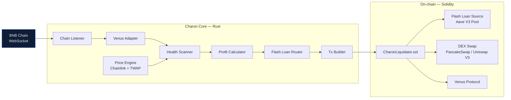

# Charon

> Multi-chain, flash-loan-backed liquidation bot — written in Rust.

[](LICENSE)
[](https://www.rust-lang.org/)
[](#roadmap)

Charon monitors under-collateralized positions across major DeFi lending protocols and executes profitable liquidations using flash loans — **zero upfront capital, zero position risk**. If a liquidation turns out to be unprofitable at execution time, the entire transaction reverts atomically; the only cost is a failed simulation's gas.

> Named after the mythological ferryman. Charon carries underwater positions to their final destination.

---

## Table of Contents

- [Status](#status)
- [How it works](#how-it-works)
- [Key features](#key-features)
- [Safety model](#safety-model)
- [Getting started](#getting-started)
- [Configuration](#configuration)
- [Project structure](#project-structure)
- [Roadmap](#roadmap)
- [Contributing](#contributing)
- [License](#license)

---

## Status

**v0.1 — work in progress.** The foundation is in place: Cargo workspace, normalized types, the `LendingProtocol` trait, a TOML config loader with env-var substitution, and a runnable CLI that validates and reports on the loaded config. Chain listening, health scanning, and on-chain execution arrive in the next phases of the build.

**Current scope:** Venus Protocol on BNB Chain. Other protocols and chains are on the [roadmap](#roadmap).

> ⚠️ **Do not run this against mainnet with real funds yet.** Nothing has been battle-tested. Treat v0.1 as development-only.

---

## How it works



1. **Listen** — A WebSocket listener receives new blocks and log events from the chain.
2. **Decode** — Protocol adapters normalize raw events into a shared `Position` struct — the rest of the pipeline doesn't care whether the source is Venus, Aave, or anything else.
3. **Price** — A price engine reads live USD prices from Chainlink, with Uniswap V3 TWAPs as a fallback when Chainlink is unavailable or stale.
4. **Scan** — The health scanner recomputes health factors and flags any position that drops below `1.0`.
5. **Estimate** — The profit calculator simulates the full liquidation end-to-end (gas + flash-loan fee + expected DEX slippage) and drops anything below a per-chain USD threshold.
6. **Route** — The flash-loan router picks the cheapest available source (Balancer 0 % → Aave V3 0.05 % → Uniswap V3 pool fee).
7. **Build** — The transaction builder encodes the call, dry-runs it via `eth_call`, signs, and submits (via Flashbots on Ethereum, private RPC on L2s).
8. **Execute** — On-chain, `CharonLiquidator.sol` atomically: flash-borrows → calls the protocol's liquidation entry point → swaps seized collateral back to the debt token → repays the flash loan → forwards profit to the bot's hot wallet. If any step fails, the entire transaction reverts.

---

## Key features

- **Zero capital required.** Every liquidation is flash-loan-backed. No pre-funded position, no locked inventory.
- **Protocol-agnostic.** Adding a new lending protocol means implementing a single Rust trait (`LendingProtocol`). No changes to scanning, routing, or execution.
- **Multi-chain by design.** A single binary monitors multiple EVM chains in parallel. v0.1 ships BSC; v0.3 expands to Ethereum, Arbitrum, Polygon, Base, and Avalanche.
- **Rust performance.** `tokio` async runtime, lock-free concurrent state via `DashMap`, sub-50 ms block-to-broadcast latency target. Designed to run comfortably on a $5 VPS.
- **Flash-loan atomicity.** Bad slippage, race conditions, and math errors all revert the transaction — the protocol never loses its liquidity, and the bot never loses capital.
- **Open source, MIT licensed.** Community extensions welcome.

---

## Safety model

Every liquidation has the atomic form:

```
borrow (flash) → liquidate → swap → repay flash → profit
```

If the chain of operations cannot repay the flash loan in full, the EVM reverts the entire transaction — including the flash borrow itself. Concretely:

| Failure mode | Outcome |
|---|---|
| Profit estimate was wrong | Tx reverts, flash source gets its capital back, bot pays only gas |
| DEX swap slippage exceeds slippage guard | Tx reverts atomically — no capital change |
| Another bot won the race | `eth_call` simulation catches 99 %+ before submit, so no gas spent |
| Oracle update mid-transaction pushes health back ≥ 1.0 | Tx reverts on the liquidation call |

**Worst case:** gas for a single failed transaction (typically $0.01–$5 depending on chain).
**Best case:** profit lands in the bot's hot wallet.
**No intermediate case** where bot capital is lost — this is the fundamental guarantee of flash-loan design.

---

## Getting started

### Prerequisites

- **Rust** — edition 2024 / `rustc 1.85+`. Install via [rustup.rs](https://rustup.rs/).
- **A BNB Chain RPC endpoint** — `.env.example` ships with public-node defaults (good for light testing, rate-limited in production). For real use, point it at a private endpoint (QuickNode, Ankr, Blast, or your own node).

### Clone and build

```bash
# via HTTPS
git clone https://github.com/obchain/Charon.git

# or via SSH
git clone git@github.com:obchain/Charon.git

cd Charon
cargo build
```

### Configure

```bash
cp .env.example .env
# edit .env with your RPC endpoints
```

### Run

```bash
cargo run -- --config config/default.toml listen
```

Expected output (v0.1 — scanner not wired up yet):

```
INFO charon: charon starting up
INFO charon: loading config path=config/default.toml
INFO charon: config loaded chains=1 protocols=1 flashloan_sources=1 liquidators=1 min_profit_usd=5
INFO charon: listen: not wired up yet — scanner arrives in Day 2
```

For verbose logs, prepend `RUST_LOG=debug`.

---

## Configuration

Charon reads a TOML config file (default path: `config/default.toml`). Secrets — RPC URLs, keys, API tokens — are referenced as `${ENV_VAR}` placeholders and substituted from the process environment (or a local `.env` file) at load time.

Example (abridged):

```toml
[bot]
min_profit_usd   = 5.0     # drop opportunities below this threshold
max_gas_gwei     = 10      # skip when gas spikes beyond this
scan_interval_ms = 1000    # polling cadence (ms)

[chain.bnb]
chain_id = 56
ws_url   = "${BNB_WS_URL}"
http_url = "${BNB_HTTP_URL}"

[protocol.venus]
chain       = "bnb"
comptroller = "0xfd36e2c2a6789db23113685031d7f16329158384"

[flashloan.aave_v3_bsc]
chain = "bnb"
pool  = "0x6807dc923806fe8fd134338eabca509979a7e0cb"
```

Environment variables expected by the default config:

| Variable | Purpose |
|---|---|
| `BNB_WS_URL` | BNB Chain WebSocket RPC endpoint |
| `BNB_HTTP_URL` | BNB Chain HTTPS RPC endpoint (for multicall) |

### Run profiles

Three TOML profiles ship in [`config/`](config/). Pick one with `--config`.

| Profile | File | When to use |
|---|---|---|
| Mainnet | `config/default.toml` | Production runs against BSC mainnet (real capital). |
| Testnet | `config/testnet.toml` | Venus on BSC testnet (Chapel, chainId 97) — no Aave V3 on Chapel, runs read-only. |
| Local anvil fork | `config/fork.toml` | Full end-to-end against a local anvil fork of BSC mainnet. Zero capital risk. |

#### Local anvil fork (full end-to-end, no capital)

Fork BSC mainnet locally. Real Venus state, real Aave V3, real PancakeSwap — liquidate real positions against a private chain.

Terminal A — boot the fork:

```sh
./scripts/anvil_fork.sh                         # forks latest block via dRPC, falls back to PublicNode
FORK_BLOCK=41000000 ./scripts/anvil_fork.sh     # pin a specific block
CHARON_ANVIL_PORT=8546 ./scripts/anvil_fork.sh  # run on a non-default port
```

Terminal B — run Charon against it:

```sh
cargo run -- --config config/fork.toml listen
```

The fork profile carries `profile_tag = "fork"`; `Config::validate` rejects it at startup if any chain's `ws_url` / `http_url` resolves to a non-loopback host. This keeps the intentionally lowered profit gate from ever pointing at mainnet by accident.

The fork profile omits `[liquidator.bnb]` by default — after `forge create` against the local anvil, add a `[liquidator.bnb]` section pointing at the deployed address to exercise the full liquidation path. Until then the CLI runs in read-only mode (scanner + metrics only).

---

## Project structure

```
Charon/
├── crates/
│   ├── charon-core/        # Shared types, LendingProtocol trait, config loader
│   ├── charon-scanner/     # Chain listener + health-factor scanner (v0.1 WIP)
│   └── charon-cli/         # Command-line binary (`charon`)
├── config/
│   └── default.toml        # Default configuration (Venus on BNB)
├── .env.example            # Environment variable template
└── Cargo.toml              # Workspace root + shared dependency versions
```

Crates planned for later phases:

- **`charon-protocols/`** — per-protocol adapters (Venus, Aave V3, Compound V3, Morpho, …)
- **`charon-flashloan/`** — flash-loan source router
- **`charon-executor/`** — transaction builder, batcher, gas strategy, nonce manager
- **`charon-telemetry/`** — Prometheus metrics + Telegram alerting
- **`contracts/`** — Foundry workspace housing `CharonLiquidator.sol`

---

## Roadmap

Tracked on GitHub: [obchain/Charon › Milestones](https://github.com/obchain/Charon/milestones).

### v0.1 — Venus on BNB *(current)*

- [x] Cargo workspace + three-crate skeleton
- [x] Core types (`Position`, `LiquidationOpportunity`, `FlashLoanSource`, `SwapRoute`, …)
- [x] `LendingProtocol` trait
- [x] TOML config loader with env-var substitution
- [x] CLI with `--config` flag and `listen` subcommand
- [ ] Venus adapter — fetch positions, compute liquidation params
- [ ] Chainlink price engine (with Uniswap V3 TWAP fallback)
- [ ] Health-factor scanner + near-liquidation cache
- [ ] `CharonLiquidator.sol` (Foundry) + deploy script
- [ ] Flash-loan router (Aave V3 on BSC)
- [ ] DEX swap optimizer (PancakeSwap / Uniswap V3)
- [ ] Transaction builder with `eth_call` simulation
- [ ] Prometheus metrics + Telegram alerts
- [ ] Docker Compose deployment

### v0.2 — Multi-protocol *(planned)*

- Aave V3 adapter
- Compound V3 adapter
- Morpho Blue adapter
- Protocol-specific close-factor handling

### v0.3 — Multi-chain *(planned)*

- Ethereum Mainnet (with Flashbots bundle submission)
- Arbitrum One
- Polygon PoS
- Base
- Avalanche C-Chain

---

## Contributing

Contributions are welcome. A few ground rules:

1. **Open an issue first** for non-trivial changes, so the design can be discussed before code is written.
2. **One logical change per PR.** Keep commits focused and follow conventional titles (`feat(core):`, `fix(scanner):`, `chore:`, etc.).
3. **Respect the crate boundaries.** Protocol changes live in `charon-protocols/`, execution changes in `charon-executor/`. Shared types belong in `charon-core`.
4. **No secrets in the repo — ever.** `.env` is git-ignored. Keep it that way.

New to the codebase? Check issues tagged [`good first issue`](https://github.com/obchain/Charon/labels/good%20first%20issue).

---

## License

MIT — see [LICENSE](LICENSE).
